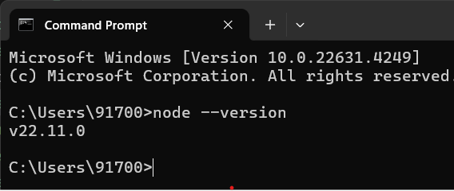

## React JS
- React Js is a declarative,Efficient and Flexible JavaScript Library for building reusable UI components.It is an open-source , Component-based front end library which is responsible only for the view layer of the application.It was initially developed and maintained by Facebook.

## Why we use React JS ->
- The main objective of React Js is to develop User interface (UI) that improves the speed of the apps.It uses Virtual DOM (JavaScript Object), Which improves the performance of the app. The javaScript Virtual DOM is faster than the Regular DOM. We can use the React Js on the client and server side as well as with other frameworks. It uses components and data patterns that improves readabilty and maintain larger apps.

## React create-react-app
- The create-react-app is an excellent tool for the beginners, which allows you to create and run React project very quickly. It does not take any configuration manually. This tool wrapping all of the required dependencies like webpack, Bable for react project itself and then you need to focus on writing code.
# Requirements -> 
The create React App is maintained by Facebook and can works on any platform.
FOR EXAMPLE -> MacOs, Windows, Linux.
- To create a React Project using create-react-app. you need to have installed the following things.
- 1. Node version >= 20.1.0
- 2. NPM version >= 10.6.7

- Run the following code to check the Node version in command prompt.
- $ node -version
- 

- Run the following command to check the npm version in command prompt.
- $ npm -v
- 

- In react application,there are several files and folders in the root directory, some of them are as follows.
### 1. `node_module` :- It contains the React library and any other third party libraries needed.

### 2. `public` :- It holds the public assests of the application. It contains the `index.html` where React will mount the application by default on the `

` element.

### 3. `src` :- It contains the App.css,App.js,index.js, and serviceWorker.js, Here the App.js file always responsible for displaying the output screen react.

### 4. `package-lock.json` :- It is generated automatically for any operations where npm package modifiers either the node_module tree or package.json. It cannot be published. It will be ignored if it finds any other place rather than the top-level package.

### 5. `package.json` :- It holds various metadata required for the project. It gives information to npm, which allows to identify the project as well as handle projects.

### 6. `readme.md` :- It provide the documentation to read about react topics.