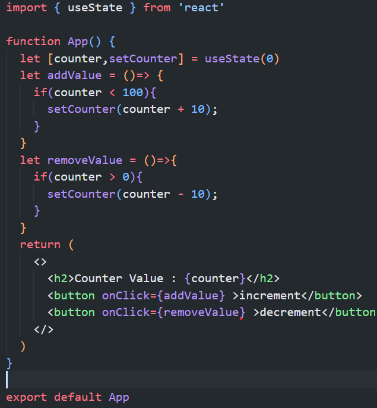
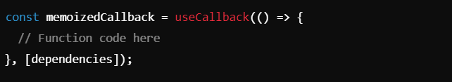
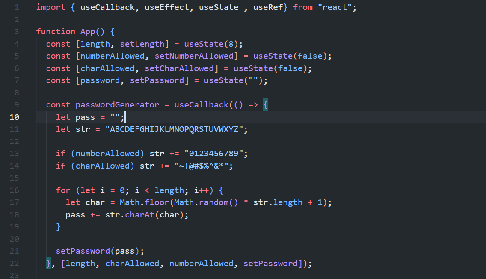
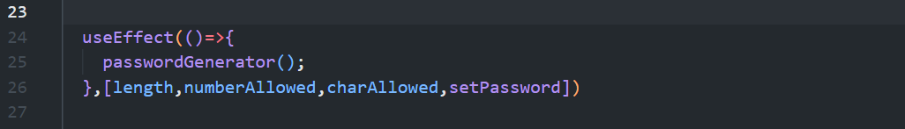
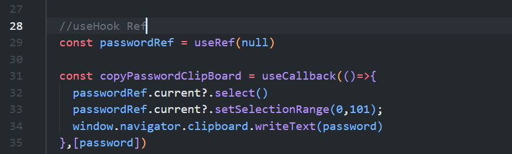
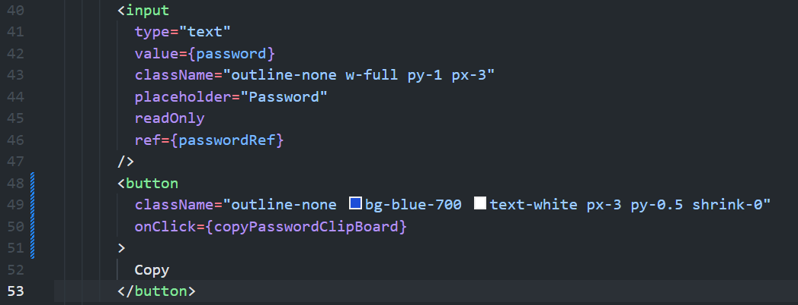
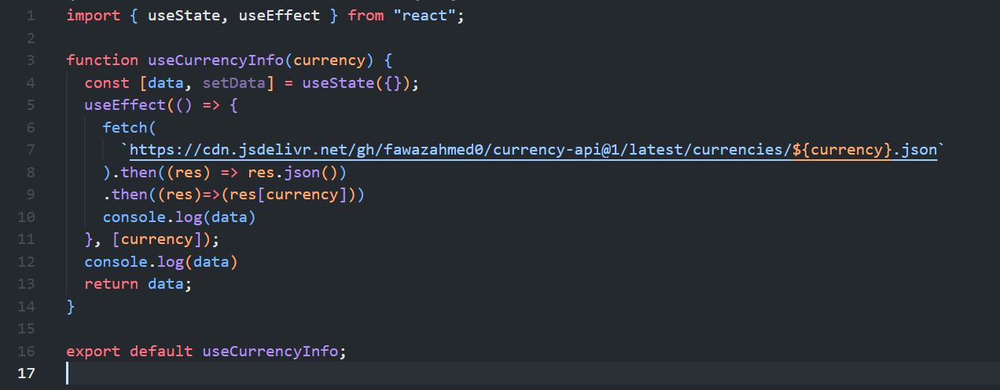

## React Features -> 

### `JSX`:-
- JSX (JavaScript XML) is a syntax extension for JavaScript commonly used with React. It allows developers to write HTML-like code within JavaScript, making it easier to define the structure of the UI in a readable and familiar way. It is not necessary to use JSX, but it is recommended to use in ReactJS.

### `React Hooks`:-
- Hooks are a feature introduced in React (16.8 version). They allow you to use state and other React features without needing to write a class component. Hooks make it easier to manage state and lifecycle features in functional components.

- `Rules of Hooks`:-
- 1. Only call hooks at the top level: Do not call hooks inside loops, conditions, or nested functions. Always call them at the top level of the component.
- 2. Only call hooks from React functions: Hooks should only be called from React function components or custom hooks, not from regular JavaScript functions.

- `Hook State`:-
- The useState hook is a new way to declare state in functional components. It allows you to set and retrieve state values in a component without using classes. The useState() hook returns an array containing the current state and a function to update that state.

- 1. ### `useState`:-
- The useState hook is one of the fundamental hooks in React. It allows you to add state to functional components, providing a way to store and manage data that may change over time. 

- `Syntax`:
- 

- `state`: The current value of the state.
- `setState`: A function that lets you update the state. When called, it triggers a re-render of the component with the updated state.
- `initialValue`: The initial value of the state, which can be any data type (number, string, object, array, etc.).

- The useState hook makes managing local state straightforward and flexible in functional components, helping build interactive UIs efficiently.

- 2. ### `useCallback`:-
- The useCallback hook in React is used to memoize functions, allowing you to optimize your components by preventing unnecessary re-creations of functions. This can be particularly useful when passing functions as props to child components, as it helps avoid triggering unnecessary re-renders.

- `Syntax`:
- 
- 

- `memoizedCallback`: The function that will be memoized.
- `dependencies`: An array of dependencies that the function depends on. The memoized function will only be re-created if one of these dependencies changes.

- 

- The `useCallback` hook can be a powerful tool to optimize React apps, especially when used thoughtfully to avoid unnecessary re-renders of components.

- 3. ### `useEffect`:-
- The useEffect hook in React is used to perform side effects in functional components. These side effects can include tasks like data fetching, direct DOM manipulation, setting up subscriptions, and cleaning up resources. useEffect replaces lifecycle methods like componentDidMount, componentDidUpdate, and componentWillUnmount found in class components.

`Syntax`:
- 
- 

- `Callback Function`: This function contains the side effect code. It runs after the component renders.
- `Cleanup Function` (Optional): If you return a function from useEffect, it will run when the component unmounts or before the effect is re-executed.
- `Dependency Array`: An array of values that useEffect depends on. The effect only re-runs when one of these dependencies changes.

- The useEffect hook provides a powerful and flexible way to handle side effects and manage lifecycle behaviors in functional components!

- 4. ### `useRef`:- 
- The useRef hook in React provides a way to create a persistent reference to a value that doesn't trigger a re-render when it changes. This hook is commonly used to store references to DOM elements and maintain mutable values across renders.

- `Syntax` :- 
- 
- 
- 

- `initialValue`: The initial value for the ref object, which will be stored in ref.current.
- `ref.current`: The value held by the ref object, which you can read or update directly without causing a re-render.

- The useRef hook is a powerful tool to manage non-rendering-related data and DOM references, adding flexibility to how you handle state and side effects in React!

### `Custom Hooks`:- 
- In React, custom hooks are functions that let you reuse stateful logic across multiple components. They allow you to encapsulate and share behavior (like data fetching, form handling, animations, etc.) without the need for classes or duplicating code. Custom hooks typically start with use (following the naming convention of built-in hooks like useState and useEffect), which makes them recognizable to React and ensures they follow hook rules.

- Custom hooks in React are a powerful way to simplify code and make it modular, making it easier to read, test, and maintain. You can mix and match hooks to suit any complex logic or behavior you need across different components.

### `Component`:-
- React Js is all about components, React Js application is made up of multiple component and each component has its own logic and control. These components can be reusable which helps you to maintain the code when working on a large scale project.

### `One-Way Data Binding`:- 
- React is designed to follow a unidirectional data flow, also known as one-way data binding. This means that data flows in a single direction, typically from a parent component to its child components. One-way data binding provides better control over application behavior, making it easier to track data changes and debug issues. Since components are intended to be immutable, they do not directly modify the data passed to them. If data needs to flow in the opposite direction (from child to parent), additional features like callback functions or state management libraries (e.g., Redux) are used.

- This version clarifies that data flows in one direction and highlights the approach to managing data flow from child to parent components.

### `Virtual DOM`:- 
- A Virtual DOM object is a lightweight copy of the actual DOM. It does not work like one-way data binding but rather serves as an efficient way to update the UI. When a change occurs in the application (such as a change in state or props), React re-renders the entire UI in the Virtual DOM. React then compares this updated Virtual DOM with the previous Virtual DOM snapshot to identify only the elements that have changed. This process, known as diffing or reconciliation, allows React to update only the parts of the real DOM that actually changed, rather than re-rendering the entire DOM. This selective updating makes the process efficient and helps optimize performance.

- This revision corrects the explanation, emphasizing that the Virtual DOM does not involve one-way data binding but instead optimizes how React selectively updates the real DOM based on changes detected in the Virtual DOM.

### `Simplicity`:- 
- React Js uses JSX file which makes the application simple and to code as well as understand. We know that React Js is a component based approach which makes the code reusable as your need. This make it simple to use and learn.

### `Performance`:-
- React Js is known to be great performer. This feature makes it much better than other framework out there today. The reason behind this is that it manages Virtual DOM. The DOM is a cross platform and programming API which deals with HTML,XML & XHTML. The DOM exists entirely in memory. Due to this when we create a component. We did not write directly to DOM.

