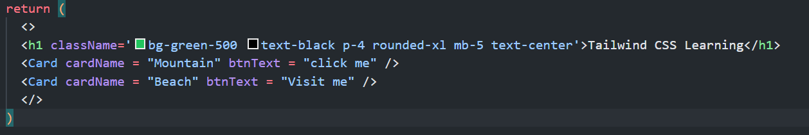
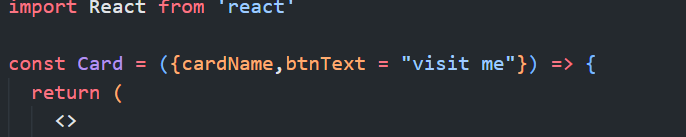
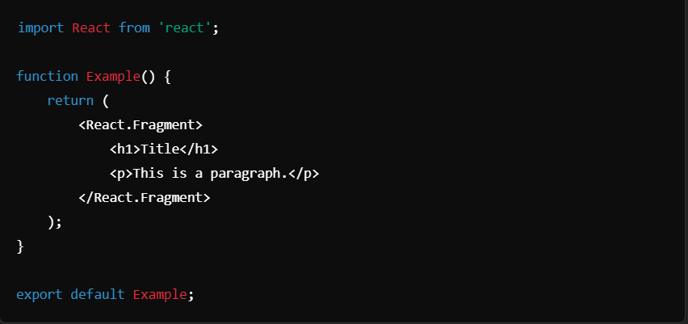
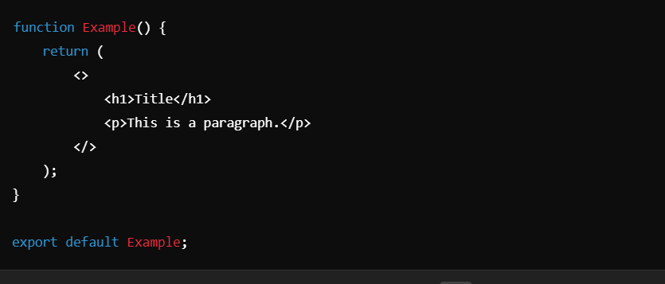
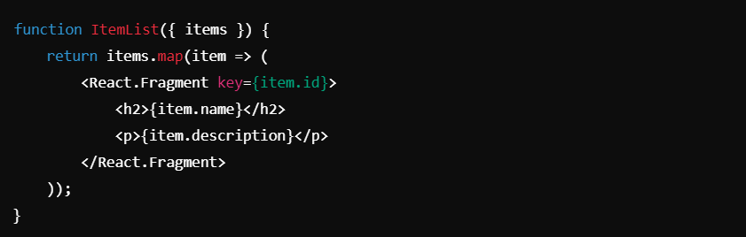

## React Props -> 

### `Props`:-
- Props (short for "properties") are objects that hold data and configurations passed from a parent component to a child component in React.
- They are used to pass data and allow components to be more dynamic and reusable.
- Props are read-only and immutable, meaning they cannot be modified by the child component that receives them. This ensures that components do not alter the data passed from the parent, preserving the unidirectional data flow in React.
- Props work similarly to HTML attributes but allow more complex and dynamic data to be passed between components.

### `Default Props`:-
It is not necessary to always add props in the ReactDOM.render() element. You can also set defaults props directly.

## React Fragments ->
- A `Fragment` is a lightweight wrapper component that allows you to group multiple elements without adding extra nodes to the DOM. This is useful when you need to return multiple elements from a component but don't want to wrap them in an additional `
` or other container,which could lead to unwanted DOM nesting.

# Syntax ->

1. ## `Explicit Syntax`

2. ## `Shorthand Syntax`: 
- React also provides a shorthand syntax, which is just an empty tag (<>) and its closing counterpart (`</>`). This is equivalent to React.Fragment.

3. ## `Key Fragments`: 
- The shorthand syntax does not accept key attribute. Fragments can accept a key attribute when used with explicit syntax. This is particularly useful when rendering a list of items.

