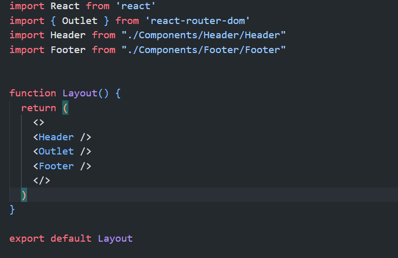

## React Router ->

- Routing is a process in which users are directed to different pages based on their actions or requests. In React, routing is mainly used for developing single-page applications (SPAs). React Router is a library used to define multiple routes in a React application, allowing users to navigate between different views without reloading the page.

- React Router is a standard library for routing in React applications. Built on top of React, it enables developers to manage navigation and URL paths. It synchronizes the displayed URL with the displayed component in the browser, providing a seamless user experience.

- `React contain different packages of routing `->
- 1. ### `react-router`:-
- This package provides the core routing components and functions for React applications. It is the foundation for routing in both web and mobile React projects.

- 2. ### `react-router-native` :- 
- This package is designed specifically for mobile applications using React Native. It allows you to implement routing in mobile apps.

- 3. ### `react-router-dom` :- 
- This package is tailored for web applications. It builds on react-router by adding components and utilities specific to the browser environment, such as <BrowserRouter> and <Link>.
- ### `$npm install react-router-dom`

### `<RouterProvider/>`
- The `RouterProvider` component is part of React Router 6 and is used to provide the router context to your application. It allows you to manage routing in a centralized way and enables features like nested routes, navigation, and history management.
- In React Router 6, `RouterProvider` is typically used in combination with a custom router created with `createBrowserRouter` (or `createHashRouter` for hash-based routing). It replaces the need to use components like `<BrowserRouter>` or `<HashRouter>`, giving you more control over routing behavior.

# Components in React Router ->
1. ### `<BrowserRouter>`:-
- The primary router component used for web applications. It manages the history stack in the browser and allows for URL-based navigation. This is usually wrapped around the main application component to enable routing throughout the app.

2. ### `Routes` and `Route`:-
- `<Routes>`:A wrapper component that holds multiple `<Route>` elements.
- `<Route>`: Defines a single route in the application. It takes a `path` prop that specifies the URL, and an `element` prop for the component to render when that path is matched.

3. ### `<Link>`
Used to navigate between routes without reloading the page. It creates accessible navigation links that update the URL and display the associated route component when clicked.

4. ### `<NavLink>`
Similar to `<Link>`, but provides additional styling capabilities. For example, it automatically applies an "active" class to indicate the currently active route, making it useful for navigation menus.

5. ### `<Navigate>`
Redirects users to a different route programmatically. It is often used in scenarios where a user should be automatically redirected after an action, like after form submission.

6. ### `<Outlet>`
Used in nested routes to render child routes. It allows components defined at nested paths to be displayed within the parent component's layout.

7. ### `useNavigate`
A hook that provides programmatic navigation. It allows you to navigate to a different route in response to an event, such as a button click, rather than clicking a link.

8. ### `useParams`
A hook that allows you to access URL parameters in a route. Useful for dynamic routing, where parts of the URL can represent variables (e.g., `/user/:userid`).

9. ### `useLocation`
A hook that provides information about the current URL, such as the pathname and search parameters. This can be helpful for determining the current route or retrieving query parameters.

10. ### `useRoutes`
A hook that enables defining routes directly within JavaScript logic, useful for dynamically creating routes based on certain conditions.

- These components and hooks collectively allow for building dynamic and flexible navigation systems in React applications.

# `Benefits of React Router`:-
1. It is not necessary to set the browser history manually.
2. It uses switch feature fr rendering. 
3. If the router needs only a single child element.
