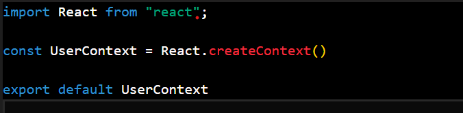
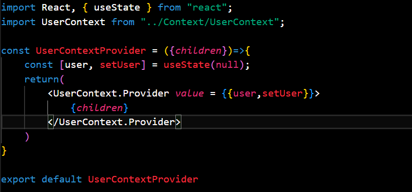

## React Context ->

- React Context is a feature in React (introduced in version 16.3) that allows you to manage and share state globally across your React application without having to pass props down manually through every level of the component tree. It is especially useful when you have global data such as user authentication, themes, or localization settings that many components need to access.

# Key Components of React Context :-

1. ## `React.createContext()`
This is used to create a Context object. It provides two key components:
-    `Provider`: Supplies the data to its child components.
-    `Consumer`: Accesses the data provided by the `Provider`.

2. ## `Provider`
- The `Provider` component is used to wrap the part of your app that needs access to the context data. It accepts a `value` prop, which is the data to be shared.

3. ## `Consumer`
- The `Consumer` component is used to access the context's value. It requires a function as a child, which receives the current context value.
